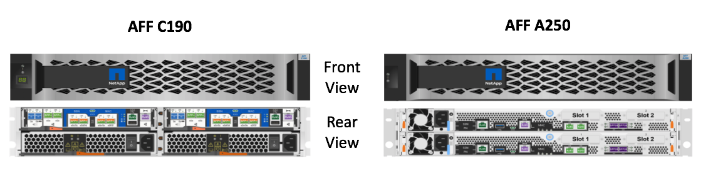

# NetApp Solutions for Cloud Paks

??? abstract "Document Control"

    !!! info "Page Owner: Jacky Ben-Bassat (GSI Technical Manager - IBM & Red Hat, NetApp)"

    !!! info "User Story"
        **As a**: Solutions Architect

        **I want to**: Learn about the IBM-Verified NetApp Storage solutions

        **So that**: I can understand what IBM-Verified NetApp solutions I can use for Cloud Paks deployments.

    !!! info "Status"
        - [ ] Structure
        - [ ] Draft
        - [X] Reviewed: Ahmed Azraq
        - [ ] Ready
        - [ ] Published:

    !!! info "Classification"
        - [ ] IBM Confidential
        - [X] Public

## NetApp Storage Solutions for IBM Cloud Paks

NetApp and IBM have been working together to qualify [NetApp All Flash FAS (NetApp AFF) platforms](https://www.netapp.com/data-storage/all-flash-documentation/) for IBM Cloud Paks.
As of early May 2021, two AFF models from NetApp were qualified - the AFF C190 and the AFF 250A. It is expected that additional AFF models with NetApp ONTAP will obtain the VERIFIED status in 2021.

**For accurate sizing of NetApp storage for any IBM Cloud Paks solution, please contact NetApp Sales team.**

| **Storage Features & Options** | **AFF C190** | **AFF A250** |
| --- | :---: | :---: |
| Description | Entry level, Departmental/SMB Storage System for Edge/remote sites and small data centers. Powered by ONTAP and Data Fabric enabled | Entry level Data Center and Enterprise- Grade, highly scalable storage system. Powered by ONTAP and Data Fabric enabled
| Min TB Capacity (Raw) | 7.7 | 15.4 |
| Storage Type | SSD, All Flash | SSD, All Flash |
| File Storage | NFS, CIFS/SMB | NFS, CIFS/SMB |
| Block Storage | FC, iSCSI | FC, iSCSI |
| NVMe | Yes | Yes |
| Max IOPs | 111,779 (NFS) 95,416 (iSCSI) | 200,711 (NFS) 184,310 (iSCSI) |
| IOPS/GB1 | 24 (NFS) 21 (iSCSI) | 25 (NFS) 23 (iSCSI) |
| Max Throughput (MB/s) | 1,921 (NFS) 1,640 (iSCSI) | 3,450 (NFS) 3,168 (iSCSI) |
| **Cloud Pak Solutions** |  |
| Integration | Yes | Yes |
| Business Automation | Yes | Yes |
| Applications (Excluding Client Workloads) | Yes | Yes |
| MultiCloud Management | Yes | Yes |
| Security | Yes | Yes |
| Data | Yes | Yes |
| Watson AIOps | Yes | Yes |
| **OpenShift Persistent Storage (NetApp Trident)** |
| CSI | Yes | Yes |
| Block | Yes | Yes |
| File | Yes | Yes |
| Dynamic Provisioning | Yes | Yes |
| Snapshots | Yes | Yes |
| Storage Classes | Yes | Yes |
| Access RWO | Yes | Yes |
| Access RWX | Yes | Yes |
| Quality of Service (QoS) | Yes | Yes |
| ARESTful APIs | Yes | Yes |
| **Advanced Data Management** | | |
| Cloud integrated | Yes | Yes |
| Data Replication | Yes | Yes |
| Cloning | Yes | Yes |
| Data Tiering | Yes | Yes |  
| Storage Efficiencies | Deduplication, Compression, Compaction, Thin Provisioning, Thin Replication | Deduplication, Compression, Compaction, Thin Provisioning, Thin Replication |
| Security and Compliance | Multifactor admin access, Secure multitenant, In-flight and data at-rest encryption, Regulatory compliant data retention, SVM for isolating workspaces | Multifactor admin access, Secure multitenant, In-flight and data at-rest encryption, Regulatory compliant data retention, SVM for isolating workspaces |
| Hypervisor Integration | VMware, KVM, RHV | VMware, KVM, RHV |
| Automation | Ansible Certified Modules. AI-informed predictive analytics and corrective action | Ansible Certified Modules. AI-informed predictive analytics and corrective action |
| **Operations** |
| Non-Disruptive Operation | Yes | Yes |
| Quality of Service (QoS) | Yes| Yes |
| Scale up/scale out non-disruptively | Yes | Yes |
1 Based on Calculated Useable Capacity

### Additional Product Information

    
Please follow the links to the NetApp product information for the [ AFF C190 ](https://www.netapp.com/data-storage/aff-c190/) and the [ AFF 250A ](https://blog.netapp.com/new-nvme-entry-system-aff-a250)  
